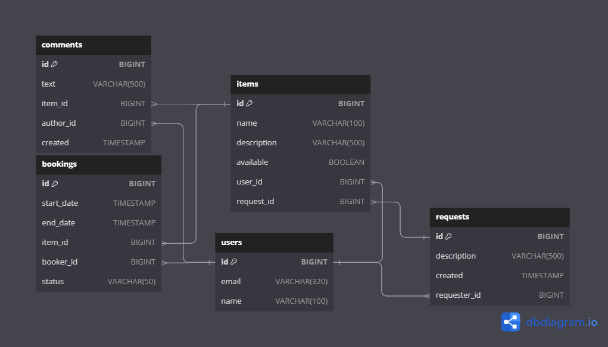

<h1 align="center">Give and take</a>

## Описание проекта

Cервис для шеринга вещей (share - делиться). Это приложение пригодится тем, кому, например, нужна вещь для единичного использования. 
Сервис позволяет:
1) Узнать какими вещами готовы поделиться пользователи;
2) Бронировать вещи на определенный срок;
3) Оставлять запрос на определенную вещь, которую не удалось найти в приложении;
4) Оставлять отзывы о вещах, если ими пользовались.

## Инструкция по развертыванию
1) Клонируйте репозиторий в IDEA;
2) Нужно перейти во вкладку maven (справа в среде разработки), и последовательно для всего проекта запустить clean и package (ShareIt -> Lifecycle -> clean, package);
3) Открыть Docker;
4) В IDEA в папке give-and-take (корневая папка) поднять docker-compose.yml для всех сервисов;
5) После развертывания сервисов скопировать из папки postman код и импортировать в Postman, чтобы проверить работоспособность программы;
6) Для завершения работы сервисов, внизу IDEA перейти в Services и завершить работу всех контейнеров.

## Микросервисная архитектура ##

В проекте предусмотрено 3 модуля:
1) шлюз для приема запросов;
2) сервер для их обработки;
3) база данных.

Структура базы данных:

Ссылка на ER диаграмму базы данных программы: https://dbdiagram.io/d/650051cb02bd1c4a5e6b13ba

В ветке add-item-requests реализованы интеграционные тесты и мок тестирование каждого слоя приложения: контроллеров, 
сервисов и базы данных.
